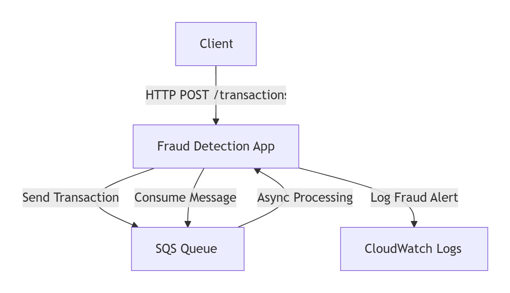
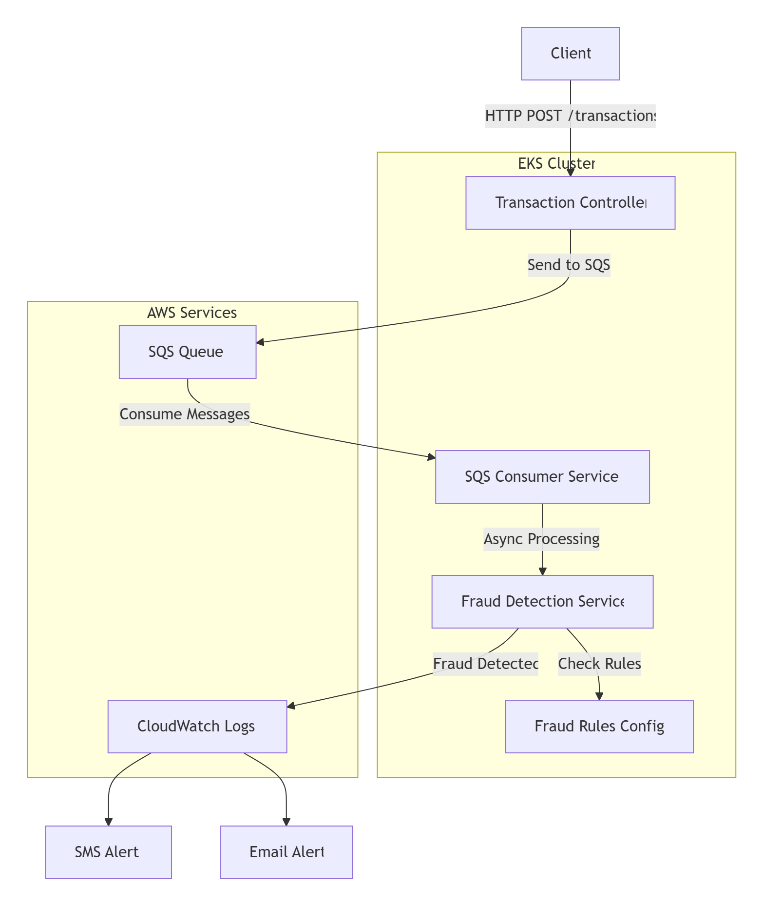
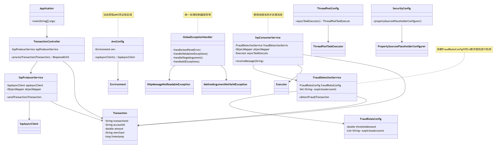
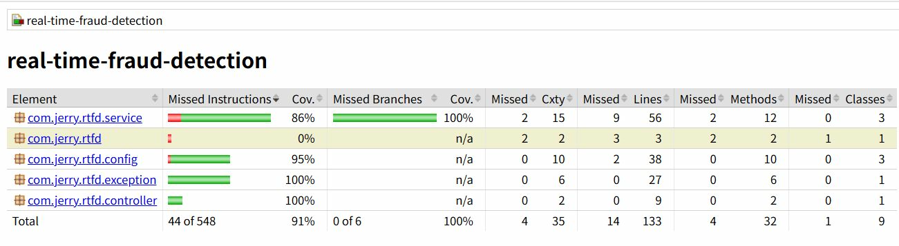

# 项目概要
## 简介
这是一个基于SpringBoot3 + Maven + Docker + K8S构建的一个web服务。当发生一笔金融交易时，可以调用该服务进行实时的欺诈检测。

## 工程概要
- 工程化较完备
  - 工程结构较合理，对不同功能进行分层设计，支持配置与代码逻辑分离，更加灵活
  - 支持全局异常Global Exception捕获和处理
  - 支持多环境部署，通过多个profile文件进行环境部署隔离
  - 基于gitflow构建了CI/CD流水线，支持编译、打包、镜像制作、镜像推送
  - 支持单元测试和生成测试报告
  - 支撑docker、k8s容器化部署
  - 支持本地运行、调试
- 安全性
  - 对秘钥进行隔离，并在.gitignore中排出秘钥，防止敏感泄露到外部
  - 构建安全的凭据链，生成环境使用EKS Account Service访问AWS服务和资源
  - 检测安全依赖和漏洞，排除安全隐患
- 功能完备
  - 支持实时检测，当发生一笔金融交易时，会实时处理交易数据，并开展欺诈检测活动
  - 当命中欺诈规则，会发送sms和email通知。
  - 支持基于简单规则的金融欺诈检测，[规则配置化][fraud-rules.properties](../src/main/resources/fraud-rules.properties)
- 性能
  - 交易数据发送、接收、处理异步化处理。交易数据异步发送到sqs队列，检测服务监听sqs队列，并基于线程池进行检测。当命中欺诈规则时，异步发送多渠道通知（这里是模拟通知）。
  - 支持容器层面的HPA，详见服务部署清单[deployment.yaml](../deployment.yaml)
## 业务流程
- 系统的主要流程如下：
  - 1.交易通过REST API（/transactions）提交到TransactionController。
  - 2.TransactionController将交易发送到SQS队列（使用SqsProducerService）。
  - 3.SqsConsumerService监听SQS队列，接收到消息后，使用异步线程池（asyncTaskExecutor）处理消息。
  - 4.异步处理中，调用FraudDetectionService进行欺诈检测。
  - 5.欺诈检测规则包括：交易金额超过阈值（thresholdAmount）或账户在可疑账户列表（suspiciousAccounts）中。
  - 6.如果检测到欺诈，则记录告警日志（模拟发送SMS和Email），这些日志将被发送到CloudWatch Logs。
- 业务流程
  - ，github有时无法正常，如果打不开，请观看视频，或克隆到本地
## 架构说明
- 架构
  - ，github有时无法正常，如果打不开，请观看视频，或克隆到本地
- 数据流
  - Client → ALB → EKS Pods → SQS → Fraud Detection → CloudWatch
  - (HTTP)---------------------(Async)---------(Rules)--------(Alerts)
- 关键组件说明
  - Client：提交交易请求的客户端
  - Transaction Controller：接收交易请求的 REST 端点
  - SQS Queue：用于解耦处理流程的消息队列
  - SQS Consumer：异步消费消息的服务
  - Fraud Detection：包含核心欺诈检测逻辑
  - Fraud Rules：可动态加载的欺诈规则配置
  - CloudWatch Logs：集中式的日志存储
- 依赖关系
  - ，github有时无法正常，如果打不开，请观看视频，或克隆到本地
- 测试报告
  - ，github有时无法正常，如果打不开，请观看视频，或克隆到本地
